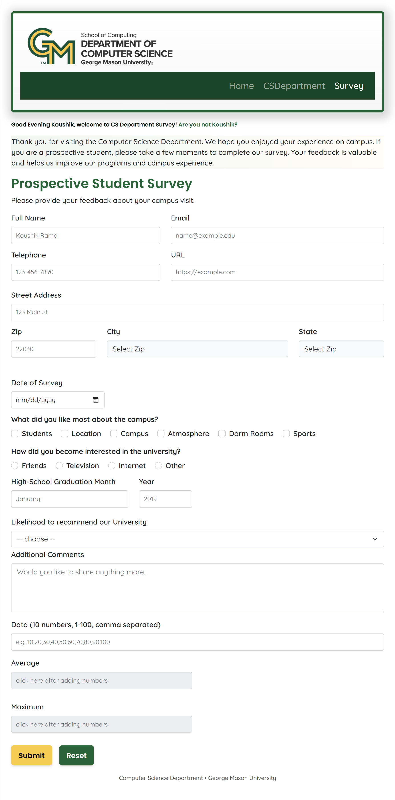

## Overview

This project is a simple student survey form created for the CS 642 course, which levrages Bootstrap for responsive styling and JavaScript for the form validation, cookies, AJAX Operations. 

## Technologies used
- HTML5
- CSS3
- Bootstrap
- JavaScript

